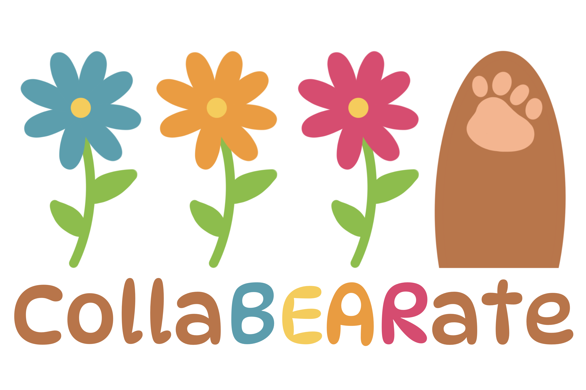

# CollaBEARate

### An agile workflow/project organization platform
## Project Features
1. Login/Logout
2. Customizable Project List
3. Meeting Invite Generator *(.ics format)*
4. Kanban Board
5. Account Page
## Future Features/Improvements
- Projects
  - Add functionality to store additional data under each project *(e.g. README, assets, Kanban board)*
- Pencil Me In
  - Different calendar invite formats aside from .ics 
  - Allow user to specify timezone rather than only supporting PST
- Backlog
  - Add a ‘Set Priority’ feature to each card
- Account
  - Change password functionality 
  - Store personal Zoom meeting link under each account so it can simply be pulled when generating meeting in ‘Pencil Me In’ rather than having to manually enter it
## Tech Stack
HTML, CSS, JavaScript